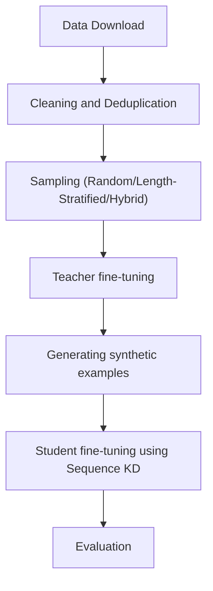

# Distillation on open-source LLMs for English to Occitan NMT

This repo hosts an end-to-end pipeline for translating English sentences to Occitan using a Mistral-7B-v0.3 model distilled using sequence KD into a TinyLlama-1.1B-intermediate-step-1431k-3T model. The model fine-tuning and knowledge distillation utilises the CCMatrix English-Occitan parallel corpus of 1.8M sentences, which is deduplicated and heavily cleaned before being used. The performance has been evaluated using a held-out set of FLORES-200, alongside a dedicated Marian MT baseline for comparison. These have also been compared against the zero-shot versions of the models used in my setup to demonstrate the performance gains from finetuning on a hard task like NMT on a low-resource langauge.

## Results

Evaluated on the FLORES-200 English→Occitan held-out 'dev' split of 997 sentences.

| Model                              | BLEU | chrF |
|------------------------------------|------|------|
| TinyLlama-1.1B-intermediate-step-1431k-3T (zero-shot student)    |  1.89 | 27.72 |
| Mistral-7B-v0.3 (zero-shot teacher)        |  2.89 | 34.10 |
| MarianMT (baseline)                |  25.91 | 56.00 |
| Mistral-7B-v0.3 (fine-tuned teacher)       |  20.01 | 48.57 |
| TinyLlama-1.1B-intermediate-step-1431k-3T (distilled student) |  7.33 | 34.35 |

The following conclusions can be derived from these results:
1. Fine-tuning gives the teacher a large lift on the task (+18.12 BLEU, +14.47 chrF over zero-shot), and a smaller but meaningful lift to the student (+5.44 BLEU, +6.63 chrF), using synthetic translations generated by the fine-tuned teacher. The fine-tuned teacher comes within ~6 BLEU(~75%) / ~8 chrF(~85%) of the MarianMT baseline, while the distilled student sits further behind. The student's metrics indicate that these synthetic translations are still prone to errors compared to a curated corpus, and the errors compounded downstream during student fine-tuning.
2. Between the teacher and student: BLEU drops sharply (-18.58) while chrF is largely retained (-7.43) despite the 7× reduction in parameters. Since chrF is character-level, this suggests the student learned the morphology and surface shape of Occitan reasonably well through distillation, but lost some of the precise lexical choices the teacher had. For a morphologically rich low-resource language like Occitan, chrF is arguably the more meaningful of the two metrics, which makes this a less discouraging result than the BLEU gap alone would suggest.
3. Despite a 30× parameter advantage (7B vs. 230M), the fine-tuned teacher still trails MarianMT, suggesting the gap is in the training setup — data filtering, hyperparameters, training duration — rather than model capacity. Improvements there would lift the teacher and, by extension, the distilled student.

## Motivation

### Introduction
This personal project was primarily an attempt to understand knowledge distillation in LLMs and their applications for machine translation. The initial idea came from [Enis and Hopkins (2024), "From LLM to NMT: Advancing Low-Resource Machine Translation with Claude"](https://arxiv.org/abs/2404.13813), which showed that knowledge distillation from a large LLM into a smaller NMT model can advance the state-of-the-art for low-resource language pairs. Due to compute issues and lack of a curated dataset, I did not replicate their results but sought to utilize their core claim and see if it can work on my setup. The paper's key claims that I have used for this project are:
1. Distillation from a larger teacher into a smaller student is a viable way to reduce parameters and inference cost while maintaining performance, even on a task like NMT, provided the teacher is finetuned well and has demonstrable performance on the specified task.
2. Translating from a different language, say xyz, to English, i.e. [xyz -> eng], is an easier task compared to [eng -> xyz] due to English-centric corpora of most available LLMs, either open-source or commercial.
This project tackles the harder direction as a baseline to see the effects of distillation in enabling translation without incurring high costs due to compute and space requirements.

### Initial Setup

I selected Occitan as the target language for three reasons:
1. It is a Romance language with some, but not too many similarities to English, given that both belong to the wider Indo-European family. That middle ground makes it a meaningful test of cross-lingual transfer rather than a trivial or impossible one.
2. It lacks the rich online corpora that languages like French and Spanish enjoy, which makes it a genuinely low-resource problem rather than a comfortable one.
3. It belongs to a larger group of similarly low-resource regional languages in the south of France that share a distinct history and culture, so progress here is, in principle, transferable to its neighbours.

For training data I used the **CCMatrix** English–Occitan parallel corpus — roughly 1.8M sentence pairs mined using the methods described in [CCMatrix: Mining Billions of High-Quality Parallel Sentences on the Web](https://github.com/facebookresearch/LASER/tree/main/tasks/CCMatrix) and hosted at [OPUS](https://opus.nlpl.eu/datasets/CCMatrix). CCMatrix is web-mined rather than hand-curated, so it is large but noisy — which is precisely what motivated the heavy cleaning and filtering stage described later.

For the models, I chose **Mistral-7B-v0.3** as the teacher and **TinyLlama-1.1B** as the student. Both were picked for the same practical reasons:
1. They are small, widely used, and well-supported through the Hugging Face API, which kept the engineering overhead low and the setup easy to reproduce.
2. Precisely because they are small, any genuine improvement on a hard low-resource task is a useful signal, and a positive result here doesn't depend on access to a frontier-scale model, so it transfers more readily to anyone working under the same constraints.

The ~7× parameter gap between teacher and student is the heart of the experiment; it's what makes the distillation worth measuring in the first place. As reference points, I evaluate both against a dedicated **MarianMT** baseline (`Helsinki-NLP/opus-mt-tc-big-en-cat_oci_spa`) and against the zero-shot versions of Mistral and TinyLlama, so the gains from fine-tuning and distillation can be read off directly. The Marian baseline was chosen because it was developed specifically for low resource languages using the Marian framework in C++. You can read more about this here: [MarianMT](https://huggingface.co/docs/transformers/en/model_doc/marian)

Compute was the binding constraint throughout, so the pipeline is built to run on a single GPU: models are loaded in 4-bit via [Unsloth](https://github.com/unslothai/unsloth) and adapted with LoRA rather than full fine-tuning. Final evaluation uses the held-out FLORES-200 English→Occitan `dev` split (997 sentences), scored with both BLEU and chrF — the latter being especially informative for a morphologically rich language like Occitan.

### Workflow in Brief

