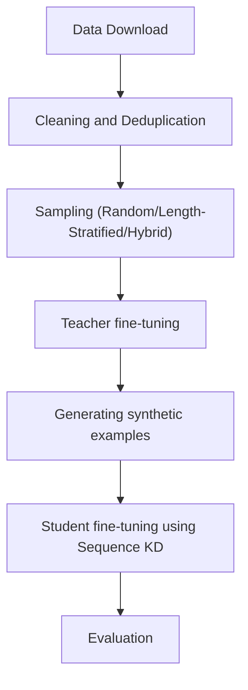

# Distillation on open-source LLMs for English to Occitan NMT

This repo hosts an end-to-end pipeline for translating English sentences to Occitan using a Mistral-7B-v0.3 model distilled using sequence KD into a TinyLlama-1.1B-intermediate-step-1431k-3T model. The model fine-tuning and knowledge distillation utilises the CCMatrix English-Occitan parallel corpus of 1.8M sentences, which is deduplicated and heavily cleaned before being used. The performance has been evaluated using a held-out set of FLORES-200, alongside a dedicated Marian MT baseline for comparison. These have also been compared against the zero-shot versions of the models used in my setup to demonstrate the performance gains from finetuning on a hard task like NMT on a low-resource langauge.

## Results

Evaluated on the FLORES-200 English→Occitan held-out 'dev' split of 997 sentences. A more detailed analysis is given at the end of the README.

| Model                              | BLEU | chrF |
|------------------------------------|------|------|
| TinyLlama-1.1B-intermediate-step-1431k-3T (zero-shot student)    |  1.89 | 27.72 |
| Mistral-7B-v0.3 (zero-shot teacher)        |  2.89 | 34.10 |
| MarianMT (baseline)                |  25.91 | 56.00 |
| Mistral-7B-v0.3 (fine-tuned teacher)       |  20.01 | 48.57 |
| TinyLlama-1.1B-intermediate-step-1431k-3T (distilled student) |  7.33 | 34.35 |

Fine-tuning lifts the teacher +18.1 BLEU over zero-shot; distillation lifts the student +5.4 BLEU. Exact model IDs are in Configuration; the full interpretation is in Evaluation & Analysis.

## Motivation

This personal project was primarily an attempt to understand knowledge distillation in LLMs and their applications for machine translation. The initial idea came from [Enis and Hopkins (2024), "From LLM to NMT: Advancing Low-Resource Machine Translation with Claude"](https://arxiv.org/abs/2404.13813), which showed that knowledge distillation from a large LLM into a smaller NMT model can advance the state-of-the-art for low-resource language pairs. Due to compute issues and lack of a curated dataset, I did not replicate their results but sought to utilize their core claim and see if it can work on my setup. The paper's key claims that I have used for this project are:
1. Distillation from a larger teacher into a smaller student is a viable way to reduce parameters and inference cost while maintaining performance, even on a task like NMT, provided the teacher is finetuned well and has demonstrable performance on the specified task.
2. Translating from a different language, say xyz, to English, i.e. [xyz -> eng], is an easier task compared to [eng -> xyz] due to English-centric corpora of most available LLMs, either open-source or commercial.
This project tackles the harder direction as a baseline to see the effects of distillation in enabling translation without incurring high costs due to compute and space requirements.

## Setup and Features

I selected Occitan as the target language for three reasons:
1. It is a Romance language with some, but not too many similarities to English, given that both belong to the wider Indo-European family. That middle ground makes it a meaningful test of cross-lingual transfer rather than a trivial or impossible one.
2. It lacks the rich online corpora that languages like French and Spanish enjoy, which makes it a genuinely low-resource problem rather than a comfortable one.
3. It belongs to a larger group of similarly low-resource regional languages in the south of France that share a distinct history and culture, so progress here is, in principle, transferable to its neighbours.

For training data I used the **CCMatrix** English–Occitan parallel corpus — roughly 1.8M sentence pairs mined using the methods described in [CCMatrix: Mining Billions of High-Quality Parallel Sentences on the Web](https://github.com/facebookresearch/LASER/tree/main/tasks/CCMatrix) and hosted at [OPUS](https://opus.nlpl.eu/datasets/CCMatrix). CCMatrix is web-mined rather than hand-curated, so it is large but noisy — which is precisely what motivated the heavy cleaning and filtering stage described later.

For the models, I chose **Mistral-7B-v0.3** as the teacher and **TinyLlama-1.1B** as the student. Both were picked for the same practical reasons:
1. They are small, widely used, and well-supported through the Hugging Face API, which kept the engineering overhead low and the setup easy to reproduce.
2. Precisely because they are small, any genuine improvement on a hard low-resource task is a useful signal, and a positive result here doesn't depend on access to a frontier-scale model, so it transfers more readily to anyone working under the same constraints.

Given both the models are of different embedding sizes, normal token-based distillation methods do not work well in such a setup as most require same architectures and vector dimensions. I have chosen Sequence KD as outlined in the paper [Sequence Knowledge Distillation](https://arxiv.org/abs/1606.07947) because it is architecture-agnostic and easy to understand. In brief, sequence KD works by finding a mode of the probability distribution generated by the teacher model across all possible sequences that can be generated. This mode is used as an approximation to generate the cross-entropy loss for the student to train on, and does not require any information about the tokenizer and model architecture.

As reference points, I evaluate both against a dedicated **MarianMT** baseline (`Helsinki-NLP/opus-mt-tc-big-en-cat_oci_spa`) and against the zero-shot versions of Mistral and TinyLlama, so the gains from fine-tuning and distillation can be read off directly. The Marian baseline was chosen because it was developed specifically for low resource languages using the Marian framework in C++. You can read more about this here: [MarianMT](https://huggingface.co/docs/transformers/en/model_doc/marian)

Compute was the binding constraint throughout, so the pipeline is built to run on a single GPU: models are loaded in 4-bit via [Unsloth](https://github.com/unslothai/unsloth) and adapted with LoRA rather than full fine-tuning. Final evaluation uses the held-out FLORES-200 English→Occitan `dev` split (997 sentences), scored with both BLEU and chrF — the latter being especially informative for a morphologically rich language like Occitan.

## Workflow in Brief



## Project Structure

```
English-to-Occitan-NMT-using-Distillation/
├── main.py                     # Orchestrates the full pipeline end to end
├── requirements.txt            # Python dependencies
├── install_dep.sh              # Installs requirements + the flash-attention wheel
├── configs/
│   ├── base_config.py          # Top-level run config (models, sizes, paths, sampling)
│   ├── cleaning_config.py      # Filtering thresholds for the cleaning stage
│   ├── teacher_config.py       # Teacher fine-tuning hyperparameters
│   └── student_config.py       # Student distillation hyperparameters
├── data/
│   ├── download_data.py        # Pulls the CCMatrix corpus from OPUS
│   ├── preprocessing.py        # Parses the raw corpus into a dataframe
│   ├── cleaning.py             # Cleaning orchestrator (lang-ID, length, punctuation, embedding filters)
│   ├── sampling.py             # Builds train / distill / early-stop splits
│   └── eval_create.py          # Builds the FLORES-200 parallel eval set
├── training/
│   ├── teacher_training.py     # Fine-tunes the Mistral-7B teacher
│   ├── teacher_generate.py     # Generates synthetic translations for distillation
│   └── student_training.py     # Distills into the TinyLlama student
├── evaluation/
│   └── eval_translation.py     # Generates translations and scores BLEU / chrF
└── utils/
    ├── load_model.py           # Loads saved models for inference/eval
    ├── checkpoint_handling.py  # Detects existing models / resumable checkpoints
    ├── tokenizer.py            # Tokenizes datasets per model
    ├── dedup.py                # Deduplication helper
    ├── lang_identify.py        # Language-ID filtering
    └── setup_langid_model.py   # Downloads/prepares the language-ID model
```

## Installation

Requires Python 3.10+ and a CUDA-capable GPU (the pipeline is built around 4-bit loading on a single GPU).

```bash
git clone https://github.com/vp0000/English-to-Occitan-NMT-using-Distillation.git
cd English-to-Occitan-NMT-using-Distillation
bash install_dep.sh
```

`install_dep.sh` installs everything in `requirements.txt` and then a prebuilt flash-attention wheel separately (it does not install cleanly from `requirements.txt`).

Create a `.env` file in the project root with the credentials the pipeline reads at startup:

```
HF_TOKEN=your_huggingface_token
WANDB_API_KEY=your_wandb_key
WANDB_PROJECT=your_wandb_project_name
# Optional: override where data and model outputs are written (defaults to ./project_data)
NMT_BASE_DIR=/path/to/output/dir
```

> **Note:** Mistral-7B is a gated model on Hugging Face. You must accept its license on the model page and use a token with access, or the teacher download will fail.

## Usage

The entire pipeline runs from a single entry point:

```bash
python main.py
```

This executes every stage in order: download → clean → sample → teacher fine-tuning → synthetic generation → student distillation → evaluation. Final BLEU/chrF metrics for all five systems are printed at the end.

The pipeline is **resumable**. Each expensive stage caches its output (cleaned data, generated translations, trained models), and on a re-run any completed stage is detected and skipped. To force a stage to recompute, delete its output under the base directory. Intermediate artifacts are written to `project_data/datasets/` (or `$NMT_BASE_DIR`), and the trained models to `mistral_occitan_finetuned/` and `tinyllama_distilled/`.

Experiment tracking defaults to Weights & Biases; set `report = "none"` in `base_config.py` to disable it and skip the W&B requirements.

## Configuration

All run settings live in `configs/`. The most commonly adjusted knobs are in `base_config.py`:

| Setting | Default | Description |
|---|---|---|
| `teacher_model` | `mistralai/Mistral-7B-v0.3` | Teacher model (Hugging Face ID) |
| `student_model` | `TinyLlama/TinyLlama-1.1B-intermediate-step-1431k-3T` | Student model |
| `marian_model` | `Helsinki-NLP/opus-mt-tc-big-en-cat_oci_spa` | Baseline MT model |
| `train_size` | `10000` | Sentences used to fine-tune the teacher |
| `distill_size` | `50000` | Synthetic examples used to distill the student |
| `train_earlystop_size` / `distill_earlystop_size` | `1000` / `5000` | Early-stopping/eval split sizes |
| `sampling_strategy` | `hybrid` | `random`, `length-stratified`, or `hybrid` |
| `cleaning_flag` | `True` | Toggle the cleaning/filtering stage |
| `report` | `wandb` | `wandb` or `none` |

Deeper tuning lives in the other config files: filtering thresholds (language-ID confidence, length and punctuation ratios, embedding/quantile cutoffs) in `cleaning_config.py`, and training hyperparameters in `teacher_config.py` and `student_config.py`.

## Limitations & Future Work

**Limitations**
- The student is trained on *synthetic* translations from the teacher, so the teacher's errors compound downstream — visible in the sharper BLEU drop relative to chrF.
- The fine-tuned teacher still trails the MarianMT baseline. The evidence points to the training setup (data filtering, hyperparameters, training duration) rather than model capacity as the bottleneck.
- Only ~10k of the available 1.8M sentence pairs were used for teacher fine-tuning, a deliberate compute compromise that almost certainly caps achievable quality.
- Only the harder English→Occitan direction is evaluated, and only on the FLORES-200 `dev` split.

**Future Work**
- Scale up `train_size` / `distill_size` and tune hyperparameters and training duration to close the gap to Marian.
- Strengthen the cleaning stage and measure its isolated effect on final scores.
- Compare sequence-level KD against soft/logit-level distillation, and sequence interpolation.
- Add the easier Occitan→English direction as a contrast, per the asymmetry noted in the motivation.
- Evaluate on the held-out FLORES `devtest` split and report confidence across seeds.

## License

This project is released under the MIT License — see `LICENSE` for details. Note that the upstream models and datasets (Mistral-7B, TinyLlama, MarianMT, CCMatrix, FLORES-200) carry their own licenses and usage terms.

## Citation

This project builds on:

```bibtex
@article{enis2024llm,
  title   = {From LLM to NMT: Advancing Low-Resource Machine Translation with Claude},
  author  = {Enis, Maxim and Hopkins, Mark},
  journal = {arXiv preprint arXiv:2404.13813},
  year    = {2024}
}
```

## Acknowledgements

- **CCMatrix** / **OPUS** and the **LASER** project for the parallel corpus.
- **FLORES-200** for the evaluation benchmark.
- **Helsinki-NLP** for the MarianMT baseline model.
- **Unsloth** for efficient 4-bit fine-tuning on a single GPU.

## Evaluation & Analysis

Every system is scored against two reference points so the gains from each stage can be read off directly. MarianMT (Helsinki-NLP/opus-mt-tc-big-en-cat_oci_spa) is a model built specifically for this language group and stands in as the off-the-shelf state of the art — the target to close on. The zero-shot Mistral and TinyLlama runs are the floor, showing what each model does before any task-specific training. Together they bracket the fine-tuned teacher and the distilled student from both sides. Both BLEU and chrF are reported; for a morphologically rich language like Occitan, the character-level chrF is arguably the more meaningful of the two.
1. Fine-tuning helps both models, distillation carries part of that gain to the student. Fine-tuning gives the teacher a large lift (+18.12 BLEU, +14.47 chrF over zero-shot), and a smaller but meaningful lift to the student (+5.44 BLEU, +6.63 chrF) via the teacher's synthetic translations. The fine-tuned teacher comes within ~6 BLEU (~75%) / ~8 chrF (~85%) of the MarianMT baseline, while the distilled student sits further back. The student's scores indicate the synthetic translations still carry errors relative to a curated corpus, and those errors compound downstream during student fine-tuning.
2. The student keeps Occitan's surface form better than its exact wording. From teacher to student, BLEU drops sharply (-18.58) while chrF is largely retained (-7.43), despite the 7× reduction in parameters. Because chrF is character-level, this suggests the student learned the morphology and surface shape of Occitan reasonably well through distillation but lost some of the teacher's precise lexical choices. For a low-resource, morphologically rich language, that makes the result less discouraging than the BLEU gap alone implies.
3. The teacher's gap to Marian is about training setup, not model size. Despite a 30× parameter advantage (7B vs. 230M), the fine-tuned teacher still trails MarianMT. That points to the training setup — data filtering, hyperparameters, training duration — rather than model capacity as the bottleneck. Improvements there would lift the teacher and, by extension, the distilled student.
